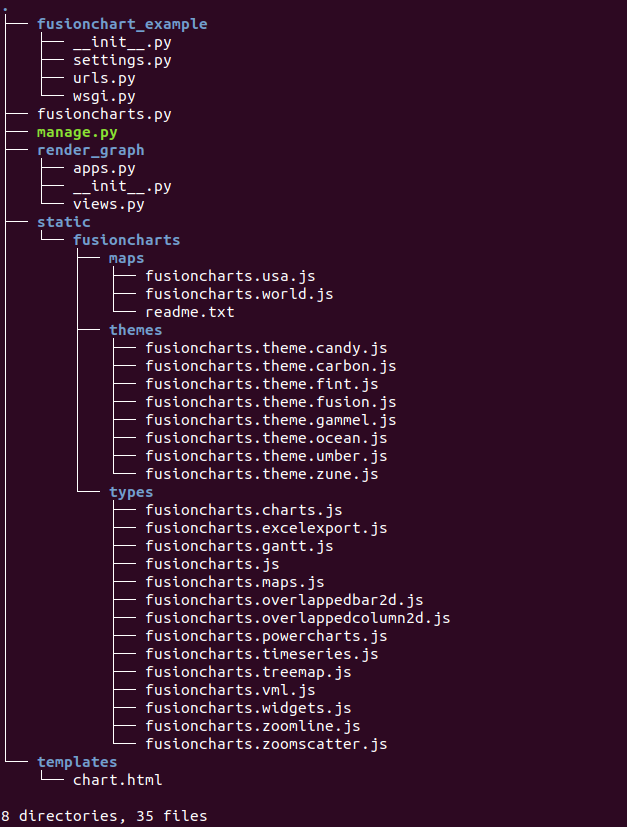
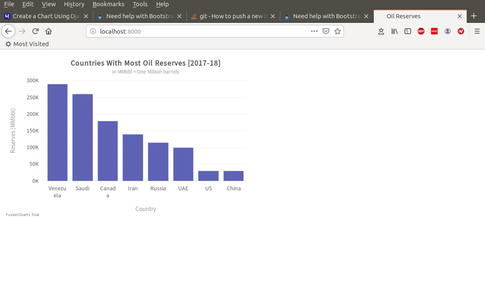

## Fusionchart example ##

You can use FusionCharts to render charts in html. I have followed the following  [instructions](https://www.fusioncharts.com/dev/getting-started/django/your-first-chart-using-django) and tweaked here and there to make it work. To replicate just do the following:

copy my github code, this will create an new project directory `fusionchart_example`.

```
git clone https://github.com/bvermeulen/fusionchart_example
```
The tree structure should look like:



go to this folder and create a virtual environment for Django, note I work with Python 3.6.8, but likely other python 3.6 or 3.7 would work ok as well.
```
python -m venv ./venv
```
activate the environment (Linux)
```
source ./venv/bin/activate
```
(or Windows)
```
./venv/scripts/activate
```
with the virtual environment enabled install Django
```
pip install django==2.2.3
```
You can now run the app
```
python manage.py runserver
````
and view the result in your browser at `127.0.0.1:8000` that should look like:



You can review the source code when you have cloned my github, especially `settings.py`, but I give `urls.py`,  `views.py` and `chart.html` below as first reference.

urls.py:
```
from django.urls import path
from render_graph import views

urlpatterns = [
    path('', views.chart, name='chart'),

]
```
views.py:
```
from django.shortcuts import render
from django.http import HttpResponse
from collections import OrderedDict

# Include the `fusioncharts.py` file that contains functions to embed the charts.
from fusioncharts import FusionCharts
from pprint import pprint

def chart(request):

    #Chart data is passed to the `dataSource` parameter, like a dictionary in the form of key-value pairs.
    dataSource = OrderedDict()

    # The `chartConfig` dict contains key-value pairs of data for chart attribute
    chartConfig = OrderedDict()
    chartConfig["caption"] = "Countries With Most Oil Reserves [2017-18]"
    chartConfig["subCaption"] = "In MMbbl = One Million barrels"
    chartConfig["xAxisName"] = "Country"
    chartConfig["yAxisName"] = "Reserves (MMbbl)"
    chartConfig["numberSuffix"] = "K"
    chartConfig["theme"] = "fusion"

    # The `chartData` dict contains key-value pairs of data
    chartData = OrderedDict()
    chartData["Venezuela"] = 290
    chartData["Saudi"] = 260
    chartData["Canada"] = 180
    chartData["Iran"] = 140
    chartData["Russia"] = 115
    chartData["UAE"] = 100
    chartData["US"] = 30
    chartData["China"] = 30

    dataSource["chart"] = chartConfig
    dataSource["data"] = []

    # Convert the data in the `chartData`array into a format that can be consumed by FusionCharts.
    #The data for the chart should be in an array wherein each element of the array
    #is a JSON object# having the `label` and `value` as keys.

    #Iterate through the data in `chartData` and insert into the `dataSource['data']` list.
    for key, value in chartData.items():
        dataSource["data"].append({'label':key, 'value': value})

    # print the datasource to see what will be rendered
    pprint(dataSource)

    # Create an object for the column 2D chart using the FusionCharts class constructor
    # The chart data is passed to the `dataSource` parameter.
    column2D = FusionCharts("column2d", "Oil_Reserves", "600", "400", "Oil_Reserves-container", "json", dataSource)

    context = {'output': column2D.render(), }

    return render(request, 'chart.html', context)
```

chart.html:
```
<!DOCTYPE html>
<html>
  <head>
    <title>Oil Reserves</title>
    
    <script type="text/javascript" src=""></script>
    <script type="text/javascript" src=""></script>

  <link rel="icon" href="data:,">
  </head>

  <body>
    <div id="Oil_Reserves-container">{{ output|safe }}</div>
  </body>

</html>
```
Fusioncharts says this is a trial version, so better check if any costs are involved. Let me know if you need any more info. Good luck...

Bruno Vermeulen
bruno.vermeulen@hotmail.com
8 July 2019
